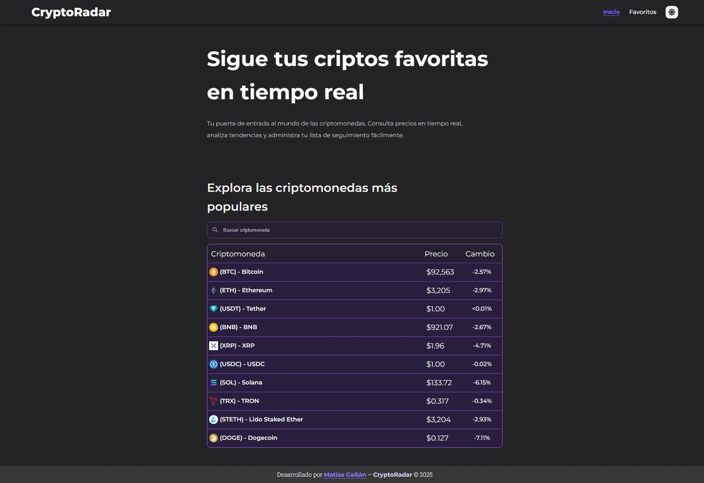
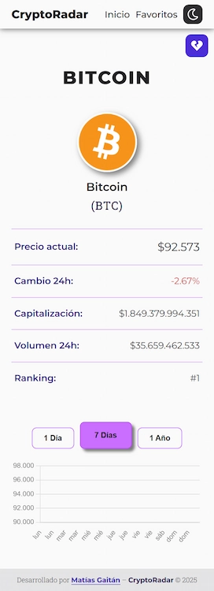

# CryptoRadar App - Seguimiento y análisis de criptomonedas en tiempo real

CryptoRadar es una **aplicación web SPA** desarrollada con **React + Vite** que permite explorar, analizar y seguir criptomonedas en tiempo real utilizando la **API de CoinGecko**. La app ofrece gráficos interactivos, sistema de favoritos, modo claro/oscuro y una experiencia fluida y optimizada tanto en desktop como en mobile.

🔗 Demo online: https://cryptoradarapp.netlify.app/

---

## 🖼️ Capturas de la aplicación

### Home — Desktop (Dark Mode)


### Detalle de criptomoneda — Mobile (Light Mode)


---

## ⚙️ Tecnologías Utilizadas

El proyecto es una aplicación frontend desarrollada en React, con foco en el rendimiento, la organización del código y una buena experiencia de usuario:

- **React** — Biblioteca principal para la UI
- **Vite** — Entorno de desarrollo rápido y liviano
- **React Router DOM** — Navegación SPA y manejo de rutas
- **CoinGecko API** — Datos de mercado de criptomonedas
- **Chart.js** + **react-chartjs-2** — Gráficos históricos interactivos
- **React Toastify** — Notificaciones visuales (toasts)
- **React Icons** — Iconografía
- **CSS3** — Estilos con enfoque responsive
- **Web Storage API (sessionStorage)** — Cacheo de datos de la API
- **Git & GitHub** — Control de versiones
- **Netlify** — Deploy y hosting

---

## 🧩 Funcionalidades

### Funcionalidades principales

- 📈 Visualización del **Top 10 de criptomonedas** por capitalización de mercado y cacheo del **Top 100** para la búsqueda dinámica.
- 🔍 **Búsqueda de criptomonedas** con navegación a resultados.
- 📄 **Página de detalle** individual por criptomoneda.
- 📊 **Gráficos históricos de precios** (1 día, 7 días, 1 año).
- ⭐ **Sistema de criptomonedas favoritas** persistido en el navegador.
- 🌗 **Modo claro / oscuro**.
- 🔔 **Notificaciones visuales (toasts)** para acciones del usuario y errores.
- ⚠️ **Manejo de errores de API**, mostrando avisos al usuario cuando la api falla.
- 🔗 Navegación fluida en una **SPA** sin recargas.
- 📱 **Diseño responsive** optimizado para mobile y desktop.

---

## 🧠 Características técnicas destacadas

- **Cacheo inteligente de datos** de la API en `sessionStorage` para:
  - Reducir llamadas innecesarias a CoinGecko
  - Mejorar tiempos de carga
  - Optimizar la experiencia de usuario

- **Manejo centralizado de errores de API**, permitiendo:
  - Mostrar mensajes claros al usuario ante fallos en las peticiones
  - Manejar escenarios de limites de peticiones de la API
  - Evitar estados inconsistentes en la UI

- **Arquitectura modular**, separando:
  - Componentes reutilizables
  - Servicios de datos
  - Utilidades comunes

---

## 📁 Estructura del proyecto

```
/
├─ public/
│   └─ favicon.webp
├─ src/
│   ├─ components/
│   │   ├─ CryptoChart/
│   │   ├─ CryptoList/
│   │   ├─ CryptoCard/
│   │   ├─ SearchBar/
│   │   ├─ NavBar/
│   │   ├─ Footer/
│   │   ├─ ThemeToggleButton/
│   │   ├─ PageTitleManager/
│   │   ├─ ScrollToTop/
│   │   └─ Loader/
│   ├─ context/
│   │   └─ ThemeContext.jsx/
│   ├─ icons/
│   ├─ layouts/
│   ├─ pages/
│   │   ├─ HomePage/
│   │   ├─ DetailPage/
│   │   ├─ SearchResultsPage/
│   │   ├─ WatchlistPage/
│   │   └─ NotFoundPage/
│   ├─ services/
│   │   ├─ favoriteService.js
│   │   └─ cryptoService.js
│   ├─ utils/
│   │   ├─ toast.js
│   │   ├─ apiErrorHandler.js
│   │   └─ pageTitles.js
│   ├─ styles/
│   │   └─ base.css
│   ├─ App.jsx
│   ├─ ReactRouter.jsx
│   └─ main.jsx
├─ index.html
├─ vite.config.js
└─ package.json
```

---

## 👨‍💻 Autor

Desarrollado por **Matías Gaitán**  

**GitHub**: https://github.com/gaitanmatias  
**LinkedIn**: https://linkedin.com/in/gaitanmatias
